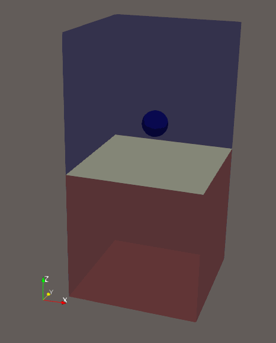

# **CFDEMInterFoamIB**
A resolved CFD-DEM coupling solver for two-phase fluid interaction with particles

1. Before installing this solver, ensure that the CFDEM+LIGGGHTS+OpenFOAM are correctly installed.  
**A Chinese tutorial to install the CFDEM+LIGGGHTS+OpenFOAM:**  
[如何安装 CFDEM+OpenFOAM+LIGGGHTS（COOL 三件套）](docs/base_cn.md)
2. To install this solver, you just need to run the "remake" file after you successfully installed the previous codes.

## WSL environment setup

For step-by-step installation and compilation in WSL, see the [Chinese WSL setup guide](docs/wslSetup_cn.md).

## Introduction to tutorial cases
1. single_sphere  
This case is used to show the interaction between particle and two-phase fluid in the settling process. Phenomena such as the cavity, splashing, and back-jet can be observed.  
2. multi_sphere_fish  
This case is an application of using the DEM clump. A clump consisting of overlapping sub-spheres is constructed to represent a fish-shaped object. Users should learn how to do multi-sphere modeling in LIGGGHTS.

## Animations of some cases:  
### Sphere settling (corresponds to the tutorial case "single_sphere"):  

For the current simulation settings and run procedure, see the [single-sphere tutorial guide](docs/single_sphere_set.md).

### Fish settling (corresponds to the tutorial case "multi_sphere_fish"): 
  

### Seepage (not included in tutorial cases):  
  

### Overtopping (not included in tutorial cases):  
  

## Literature about this solver:  
[Shen, Z., Wang, G., Huang, D., & Jin, F. (2022). A resolved CFD-DEM coupling model for modeling two-phase fluids interaction with irregularly shaped particles. Journal of Computational Physics, 448, 110695.](https://www.sciencedirect.com/science/article/pii/S0021999121005908)

## Notice:  
This solver is still on an early release. Questions about installation, compilation, and tutorial cases are welcome.

## Changelog
2023-05-11:
A case named "multi_sphere_fish" is added in the tutorial. This case can help users learn how to use the clump DEM model in coupling.
